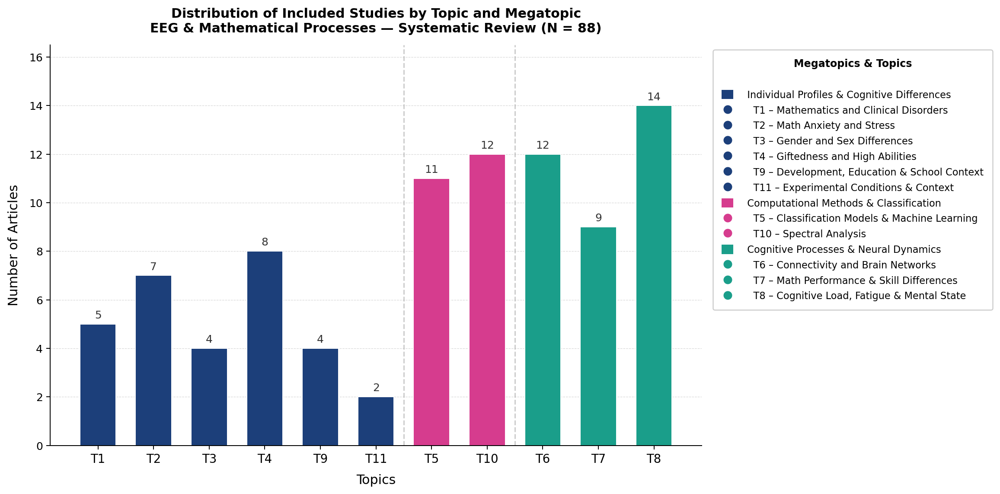
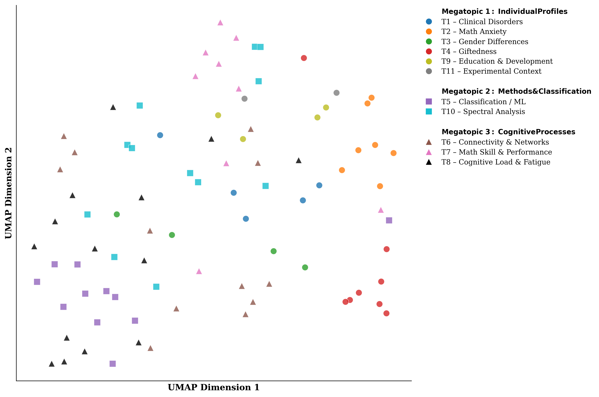

# Q1. Como o campo de EEG aplicado à cognição matemática evoluiu ao longo do tempo e quais padrões científicos emergem?

# 🔹 Bloco 1 — Bibliometria (estrutura do campo)
- Ano da primeira publicação
- País

## 📝 Plano de Análise — Bloco 1
Neste bloco, focamos na evolução temporal e na distribuição geográfica da produção científica.

### 1. Extração Quantitativa
*   **Dados:** Agrupamento por `Ano da primeria publicação` e `País`.
*   **Métricas:** Contagem absoluta e frequência relativa (porcentagem).

### 2. Análise Estatística
*   **Tendência Temporal:** Cálculo do CAGR (Taxa de Crescimento Anual Composta) para identificar a aceleração do campo.
*   **Concentração:** Identificação do Top 5 e Top 10 países que dominam a produção.

### 3. Visualizações (Gráficos/Imagens)
*   **Gráfico 1:** Gráfico de Barras Empilhadas ou Linha mostrando a **evolução anual** das publicações.
*   **Gráfico 2:** Mapa Mundi de Calor (Choropleth) ou Gráfico de Barras Horizontais para a **distribuição geográfica**.

### 💡 Insights Esperados
- Identificar o marco inicial da pesquisa EEG-Math.
- Observar se houve um salto de interesse em um período específico (ex: última década).
- Verificar se a produção é globalmente equilibrada ou concentrada em poucos centros tecnológicos.

# 🔹 Bloco 2 — Perfil metodológico global (macro)
- Tipo de Investigação
- Dimensão Temporal
- Comparação de Sujeitos

# 🔹 Bloco 3 — Estrutura temática (semântica)
- Tópicos (derivados de `math_processes`)
- Megatópicos (clusters maiores)

## Resultados (Bloco 3)

A codificação temática organizou os estudos incluídos (*N* = 88) em onze tópicos, reunidos em três megatópicos. A **Figura 1** sintetiza, de forma visual, como essa massa de trabalhos se distribui entre tópicos e megatópicos. Na leitura agregada, o megatópico **Processos cognitivos e dinâmicas neurais** aparece como o mais preenchido, seguido por **Perfis individuais e diferenças cognitivas** e, em terceiro lugar, por **Métodos computacionais e classificação** — uma hierarquia que sugere centralidade de perguntas sobre dinâmica neural e estados cognitivos em tarefas matemáticas, sem relegar o eixo metodológico a um papel marginal. Entre os tópicos, chama atenção o peso relativo de linhas que tratam de **carga cognitiva, fadiga e estado mental**, interpretáveis como ênfase em esforço, fadiga e regulação atencional no contexto do EEG e da matemática. Em contrapartida, **condições experimentais e contexto** surge como eixo menos saliente na codificação explícita, o que pode refletir tratamento mais implícito ou pulverizado do “enquadramento” do protocolo. No bloco de perfis individuais, **altas habilidades** e **ansiedade matemática / estresse** emergem como frentes reconhecíveis, ao lado de um conjunto mais heterogêneo de estudos sobre transtornos, gênero e desenvolvimento escolar. Já **análise espectral** e **modelos de classificação / aprendizado de máquina** ocupam lugar de destaque no megatópico de métodos, reforçando a presença recorrente de descritores espectrais e de abordagens de aprendizado supervisionado ou preditivo. Completando o núcleo de processos cognitivos, **conectividade e redes cerebrais** e **desempenho matemático e diferenças de habilidade** aparecem como linhas que dialogam de perto com a ideia de organização cerebral e variabilidade de desempenho.

A **Figura 2** apresenta uma projeção UMAP bidimensional dos estudos no espaço derivado das atribuições temáticas, com forma do marcador indicando o megatópico e cor o tópico. Visualmente, alguns tópicos formam aglomerados relativamente compactos — notadamente **T4** e **T2** —, o que sugere vocabulário e combinações de foco mais homogêneas dentro dessas linhas de pesquisa. **T5** tende a ocupar uma região mais lateral, compatível com um perfil de estudos centrado em classificação e aprendizado de máquina. **T7** aparece mais associado à região superior do mapa, enquanto **T1**, **T8** e **T10** mostram maior dispersão, indicando maior heterogeneidade semântica ou sobreposição com outros eixos do corpus. Há proximidade espacial considerável entre estudos do megatópico de **métodos** e do de **processos cognitivos** na porção esquerda do gráfico, coerente com a ideia de que análises espectrais, conectividade e variáveis de carga mental frequentemente coexistem nos mesmos desenhos experimentais; já o megatópico de **perfis individuais** ocupa regiões mais periféricas em alguns tópicos (p. ex., altas habilidades e ansiedade), reforçando a imagem de subcampos com identidade temática mais distinta.

Em síntese, a estrutura temática não é uniforme: predomina o bloco de dinâmicas neurais e estados cognitivos, com métodos quantitativos bem representados, enquanto tópicos clínicos e de diferenças individuais aparecem de forma mais esparsa, exceto nos núcleos de ansiedade matemática e altas habilidades, que se destacam na paisagem do corpus — inclusive pela separação mais clara no espaço UMAP.

