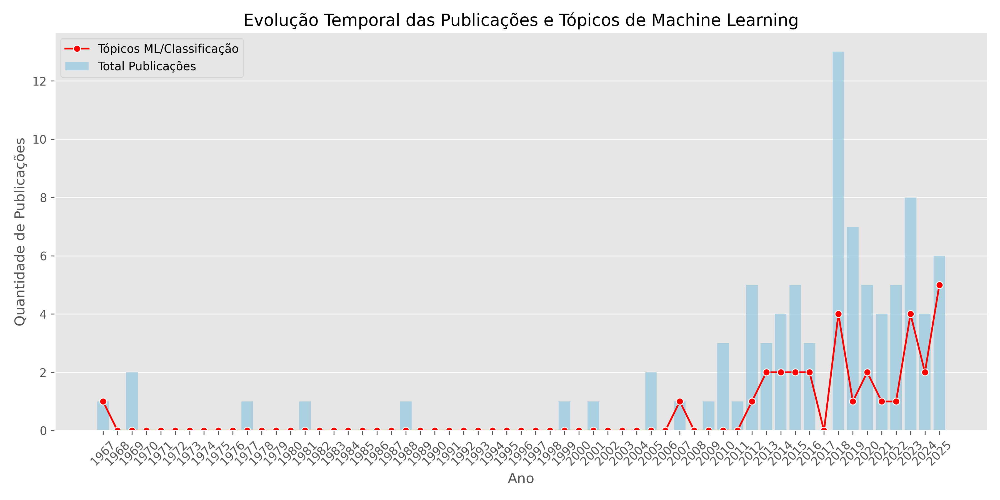

# Análise Temporal e de Tópicos: EEG e Matemática

## 1. Distribuição Anual e Ritmos de Crescimento

A análise da produção científica revela três fases distintas no desenvolvimento do campo:

### Fase 1: Latência (1967 - 2009)
Durante as primeiras quatro décadas, o campo permaneceu incipiente, com publicações esporádicas.
- **Características**: Publicações raras (0 a 2 por ano) e grandes hiatos sem produção.
- **Média**: < 1 publicação/ano.

### Fase 2: Emergência e Estabilização (2010 - 2017)
A partir de 2010, nota-se uma produção contínua, indicando a formação de uma comunidade de pesquisa e interesse constante.
- **Volume**: Média de 3 a 5 estudos por ano.
- **Destaque**: O ano de 2012 (5 estudos) marca um primeiro pico de interesse.

### Fase 3: Expansão Acelerada (2018 - Presente)
O campo experimentou um crescimento abrupto e sustentado a partir de 2018.
- **Pico Histórico**: **2018** registrou o recorde de 13 publicações em um único ano.
- **Consolidação**: Mesmo após o pico, a produção se manteve elevada (média de ~5-8 estudos/ano), superior à fase anterior.

## 2. Identificação de Períodos de Expansão

Os dados apontam **2018** como o ponto de inflexão mais crítico do campo.
- **Antes de 2018**: O crescimento era linear e modesto.
- **Pós-2018**: O volume de publicações acumulado nos últimos 7 anos (2018-2025: 52 estudos) representa cerca de **60% de toda a produção histórica** (base total de 88 estudos).

## 3. Relação com Novos Tópicos (Machine Learning)

Existe uma correlação clara entre o crescimento recente e a adoção de técnicas de Machine Learning (ML) e Classificação.

- **Adoção Tardia**: Estudos com foco explícito em classificação/ML eram raros antes de 2012.
- **Impulsionador de Crescimento**:
    - Em 2018 (ano do pico), 4 dos 13 estudos (30%) já abordavam classificação.
    - Em 2025, 5 dos 6 estudos registrados (83%) envolvem tópicos de ML.
- **Conclusão**: O ressurgimento e a manutenção do interesse no campo nos últimos anos são fortemente impulsionados pela aplicação de inteligência artificial para análise de sinais de EEG.

## Visualização
Abaixo, o gráfico ilustra a evolução temporal e a ascensão dos tópicos de ML.

